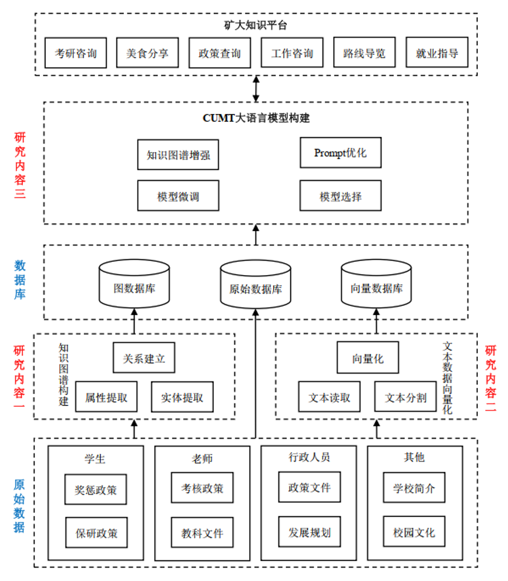
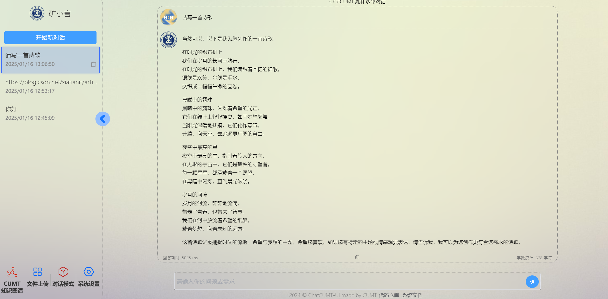
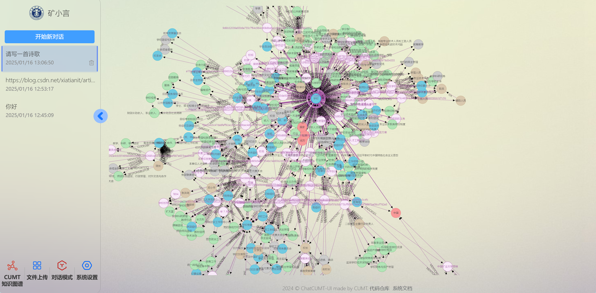
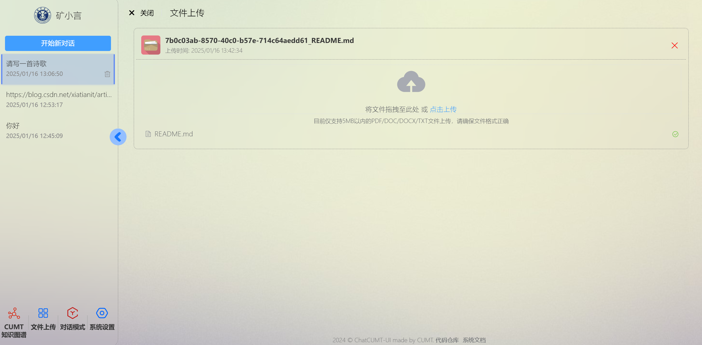
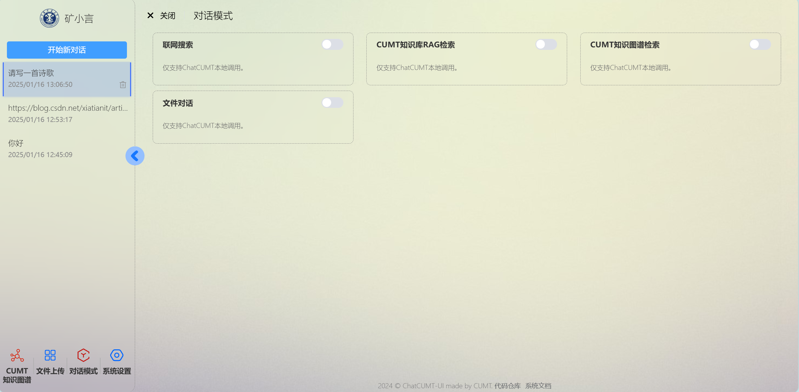
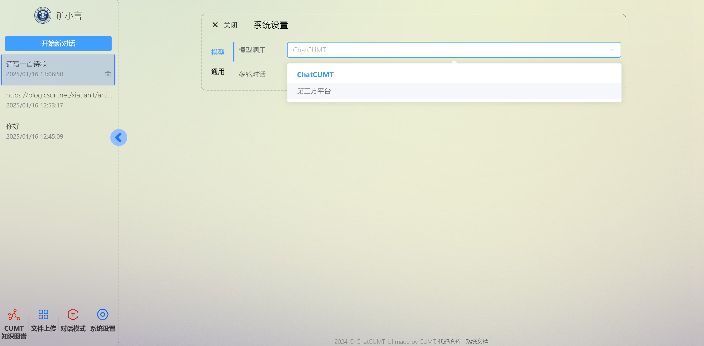
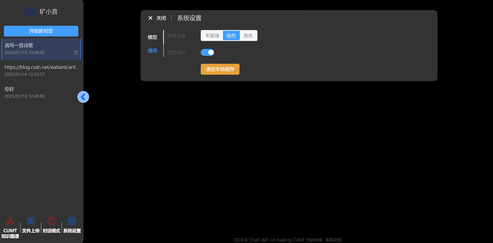

## 矿小言 - 基于大模型和知识图谱的校园知识问答系统

### 项目简介

矿小言(原名矿大知识平台)是一个集学习与研究辅助功能于一体的知识管理与服务平台。它通过整合校园知识资源，利用自然语言处理技术，为用户提供智能对话、知识图谱可视化展示、文件上传与存储、多模式对话等功能，旨在打造一个全面、便捷、高效的知识获取与应用环境。

项目应用场景图如下：



### 项目架构

- **前端仓库**：[ChatCUMT-UI](https://github.com/666xz666/ChatCUMT-UI) - 负责平台的用户界面设计与交互，提供用户友好的操作体验。
- **后端仓库**：[langchain-graph-builder](https://github.com/666xz666/langchain-graph-builder) - 基于langchain、知识图谱、RAG技术构建知识库，实现知识的系统化整合与智能化管理。

### 核心功能

- **智能对话**：基于自然语言处理技术，用户可与系统进行日常交流式的互动，快速获取所需信息。



- **知识图谱可视化**：以图形化方式直观展现复杂知识体系，帮助用户理解知识点间的内在联系。


- **文件上传与存储**：支持多种文件格式上传，方便用户管理学习资料与科研项目资料。


- **多模式对话**：提供联网搜索、知识库RAG检索、知识图谱检索、文件对话等多种模式，满足不同场景需求。



- **系统设置**：用户可个性化调整模型调用、API Key配置等，实现定制化使用体验。




### 快速启动

1. 前端启动：

```shell
npm i
npm run serve
```

2. 后端部署参考：[langchain-graph-builder 文档](https://github.com/666xz666/langchain-graph-builder/blob/main/README.md)

### 开发与维护

- **前端开发**：使用现代前端`vue`技术栈构建，注重用户体验与界面美观。
- **后端开发**：基于`langchain`等技术实现知识库的高效构建与管理，确保系统稳定运行。
- **持续更新**：定期更新知识库与系统功能，修复已知问题，提升平台性能。

